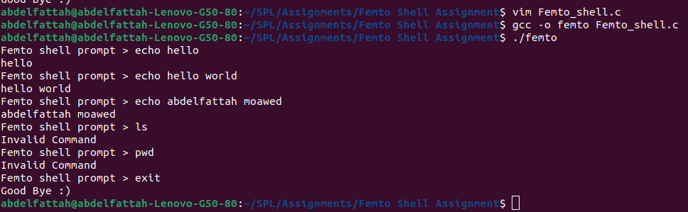

# Femto Shell

This repository contains a simple shell implementation in C called Femto Shell. The shell supports the following built-in commands:

- `echo`: Echoes any text entered by the user.
- `exit`: If the user enters "exit", the shell will reply with "Good Bye" and terminate.

## Compilation

To compile the Femto Shell, use the following command:

```sh
gcc -o myFemtoShell myFemtoShell.c
```

## Usage

To run the Femto Shell, use the following command:

```sh
./myFemtoShell
```

### Example Output



```sh
$ ./myFemtoShell
FemtoShell > echo Hello my shell
Hello my shell
FemtoShell > echo what can you do?
what can you do?
FemtoShell > echo You are super
You are super
FemtoShell > ls
Invalid command
FemtoShell > exit
Good Bye :)
$
```
