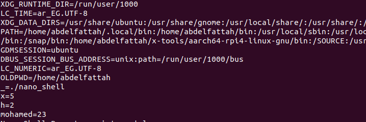

# Nano Shell

Nano Shell is a simple shell implementation that supports local and environment variables. This project extends a basic shell to allow users to define and use variables dynamically within the shell environment.

## Features

- Supports defining local variables using the format: `variable=value`.
- Ensures correct format and provides error messages for invalid assignments.
- Supports retrieving local variables using `$variable`.
- Allows exporting local variables to environment variables using the `export` command.
- Commands executed within the shell inherit all environment variables.
- Uses dynamic memory allocation for flexible variable management.
- Handles system calls safely, checking return values to prevent errors.

## Compilation

To compile the shell, use the following command:

```sh
gcc -o nano_shell nano_shell.c
```

## Usage

Run the shell using:

```sh
./nano_shell
```

Example interactions:

```sh
Nano Shell Prompt > x = 5
Invalid command
Nano Shell Prompt > x=5 echo hello world
Invalid command
Nano Shell Prompt > x=5
Nano Shell Prompt > echo $x
5
Nano Shell Prompt > folder=home
Nano Shell Prompt > ls /$folder
# list the /home directory
Nano Shell Prompt > echo $non-existing-var

Nano Shell Prompt > export x
Nano Shell Prompt > printenv
...
...
x=5
...
Nano Shell Prompt >

```
## Project Structure
```bash
Nano_shell/
├── nano_shell.c       # Main source code for Nano Shell
├── README.md          # This file
└── output.png         # Screenshot of the shell output
```

## Example Output
Below is a screenshot demonstrating the Pico Shell in action



