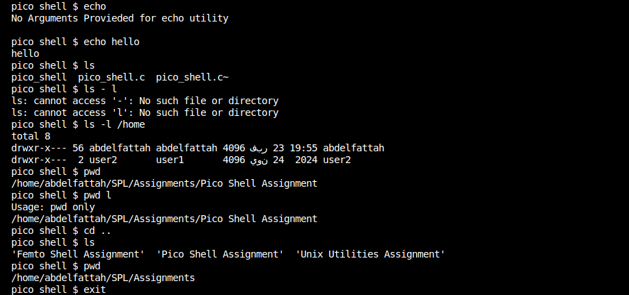

# Pico Shell Assignment

This directory contains the solution for the Pico Shell assignment. The project implements a simple Unix shell in C that supports a few built-in commands and executes external commands using fork/exec.

## Table of Contents

- [Introduction](#introduction)
- [Features](#features)
- [Requirements](#requirements)
- [Compilation](#compilation)
- [Usage](#usage)
- [Project Structure](#project-structure)
- [Example Output](#example-output)


## Introduction

The Pico Shell is a lightweight shell implemented in C. It parses user input into commands and arguments (supporting multiple successive spaces as separators) and executes them accordingly. The shell supports built-in commands—`echo`, `pwd`, `cd`, and `exit`—which are handled internally, while any other command is executed using the fork/exec system calls. In addition, the shell supports executing external programs by their name (using `execvp()` to search the system's `PATH`).

## Features

- **Built-in Commands:**
  - `echo`: Prints the given arguments.
  - `pwd`: Displays the current working directory.
  - `cd`: Changes the current working directory (note: executed in the parent process to reflect directory changes).
  - `exit`: Exits the shell.
  - `cp` : copys the files
  
- **External Commands:**
  - Executes external commands (e.g., `ls`, `grep`, etc.) by searching for them in the system `PATH` using `execvp()`.

- **Dynamic Argument Parsing:**
  - Parses the command line using dynamic allocation to handle a flexible number of arguments.
  - Handles multiple successive spaces as delimiters.

- **Robust Error Handling:**
  - Checks the return values of system calls and library functions.
  - Gracefully handles errors and prints meaningful error messages.

## Requirements

- GCC (or any standard C compiler)
- A Unix/Linux environment
- Basic understanding of system calls such as `fork()`, `execvp()`, and `chdir()`

## Compilation
Compile the Pico Shell using the following command:

```bash
gcc -o pico_shell pico_shell.c
```

This command compiles the source code (pico_shell.c) and produces the executable pico_shell.

## Usage
Run the shell by executing:

```bash
./pico_shell
```
You can then enter built-in commands or any external command. Examples:

```bash
pico shell $ pwd
/home/your-username

pico shell $ cd /etc
pico shell $ pwd
/etc

pico shell $ echo Hello, Pico Shell!
Hello, Pico Shell!

pico shell $ ls -l
(total output from ls)

pico shell $ exit
```

## Project Structure
```bash
pico_shell/
├── pico_shell.c       # Main source code for Pico Shell
├── README.md          # This file
└── output.png         # Screenshot of the shell output
```

## Example Output
Below is a screenshot demonstrating the Pico Shell in action:


